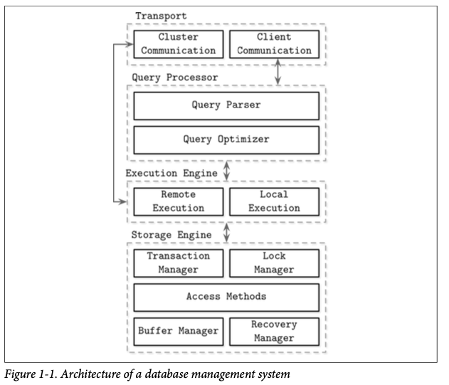
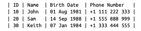
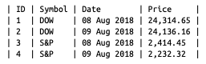

# Introduction and Overview

## DB Management System Architecture

## Memory- Versus Disk-Based DBMS

Before the operation can be considered complete, its results have to be written to a sequential log file.
To avoid replaying complete log contents during startup or after a crash, in- memory stores maintain a backup copy.
During recovery, database contents can be restored from the backup and logs.
Log records are usually applied to backup in batches. After the batch of log records is processed, backup holds a 
database snapshot for a specific point in time, and log con‐ tents up to this point can be discarded. This process is 
called checkpointing.

RAM fast, disk slow. Why? Disk-based storage structures often have a form of wide and short trees, while memory-based 
implementations can choose from a larger pool of data structures and perform optimizations that would otherwise be 
impossible or difficult to implement on disk.

## Column- Versus Row-Oriented DBMS

Row-oriented database management systems store data in records or rows. Their layout is quite close to the tabular 
data representation, where every row has the same set of fields. Since row-oriented stores are most useful in scenarios 
when we have to access data by row, storing entire rows together improves spatial locality.

Column-oriented database management systems partition data vertically (i.e., by column) instead of storing it in rows. 
Column-oriented stores are a good fit for analytical workloads that compute aggregates, such as finding trends, 
computing average values, etc.

With columns, we need to preserve some metadata on the column level to identify which data points from other columns 
it is associated with. If you do this explicitly, each value will have to hold a key, which introduces duplication and 
increases the amount of stored data. Some column stores use implicit identifiers (virtual IDs) instead and use the 
position of the value (offset) to map back.

## Distinctions and Optimizations

Storing values that have the same data type together (e.g., numbers with other numbers, strings with other strings) 
offers a better compression ratio. You need to understand your access patterns e.g. If scans span many rows, or compute 
aggregate over a subset of columns, it is worth considering a column-oriented approach.

## Data Files and Index Files

Database systems store data records, consisting of multiple fields, in tables, where each table is usually represented 
as a separate file. Each record in the table can be looked up using a search key. To locate a record, database systems 
use indexes: auxiliary data structures that allow it to efficiently locate data records without scanning an entire 
table on every access. Indexes are built using a subset of fields identifying the record.

A database system usually separates data files and index files: data files store data records, while index files store 
record metadata and use it to locate records.

Index files are typically smaller than the data files.

New records (insertions) and updates to the existing records are represented by key/ value pairs. Most modern storage 
systems do not delete data from pages explicitly. Instead, they use deletion markers (also called tombstones), which 
contain deletion metadata, such as a key and a timestamp. 

### Data files
- also called primary files
- can be implemented as index-organized tables (IOT), heap-organized tables (heap files), or hash-organized tables (hashed files)
- most of the time they are placed in a write order
- In hashed files, records are stored in buckets, and the hash value of the key deter‐ mines which bucket a record belongs to.
- Index-organized tables (IOTs) store data records in the index itself.

### Index files
- also called primary index, all other indexes are secondary
- Secondary indexes can point directly to the data record, or simply store its primary key. A pointer to a data record can hold an offset to a heap file or an index-organized table.
- While primary index files hold a unique entry per search key, secondary indexes may hold several entries per search key
- if using search key order, then it is called clustered (also known as clustering)

Many database systems have an inherent and explicit primary key, a set of columns that uniquely identify the database record. In cases when the primary key is not specified, the storage engine can create an implicit primary key

## Buffering, Immutability, and Ordering

Storage structures have three common variables: they use buffering (or avoid using it), use immutable (or mutable) files, and store values in order (or out of order). 

### Buffering
This defines whether or not the storage structure chooses to collect a certain amount of data in memory before putting it on disk. 
The smallest unit of data transfer to and from the disk is a block, and it is desirable to write full blocks.

### Mutability (or immutability)
This defines whether or not the storage structure reads parts of the file, updates them, and writes the updated results at the same location in the file.
Immutable structures are append-only.

### Ordering
This is defined as whether or not the data records are stored in the key order in the pages on disk. In other words, the keys that sort closely are stored in contigu‐ ous segments on disk. Ordering often defines whether or not we can efficiently scan the range of records, not only locate the individual data records.