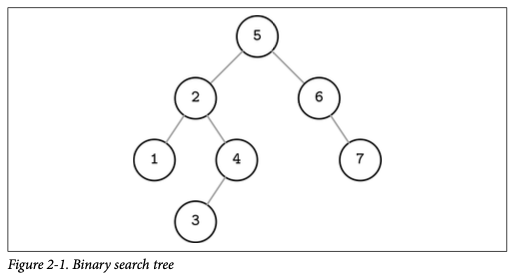
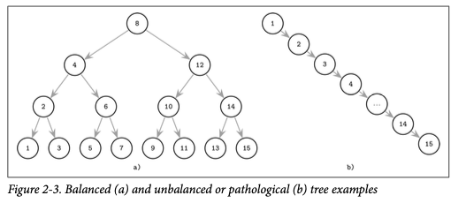
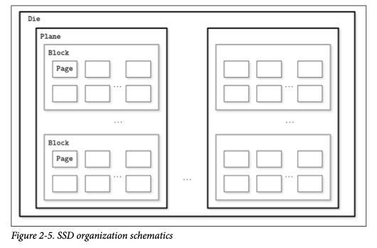
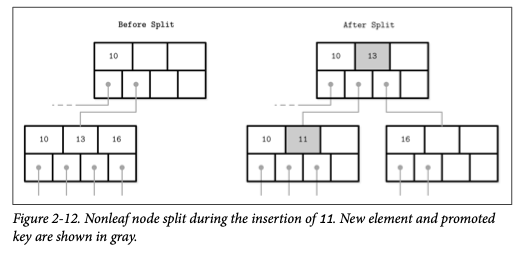
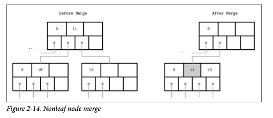

# B-Tree Basics

For the sake of simplicity, for now we assume that each key is associated only with one data record, which has a unique location.

## Tree Balancing
Worst case scenario: an unbalanced tree which looks more like a linked list, and instead of desired logarithmic complexity, we get linear

The balanced tree is defined as one that has a height of log2 N, where N is the total number of items in the tree.
Without balancing, we lose performance benefits of the binary search tree structure, and allow insertions and deletions order to determine tree shape.

One of the ways to keep the tree balanced is to perform a rotation step after nodes are added or removed.

If we wanted to maintain a BST on disk, we’d face several problems. One problem is locality: since elements are added in random order, there’s no guarantee that a newly created node is written close to its parent.

Another problem, closely related to the cost of following child pointers, is tree height. Since binary trees have a fanout of just two, height is a binary logarithm of the num‐ ber of the elements in the tree

You need to consider the two options:
- High fanout to improve locality of the neighboring keys.
- Low height to reduce the number of seeks during traversal.

## Disk-Based Structures

On spinning disks, seeks increase costs of random reads because they require disk rotation and mechanical head movements 
to position the read/write head to the desired location. 

The smallest transfer unit of a spinning drive is a sector, so when some operation is performed, at least an entire 
sector can be read or written.

Head positioning is the most expensive part of an operation on the HDD.

Solid state drives (SSDs) do not have moving parts. A typical SSD is built of memory cells, connected into strings, strings are combined into arrays, arrays are combined into pages, and pages are 
combined into blocks. Blocks are organized into planes and, finally, planes are placed on a die. SSDs can have one or more dies.

In SSDs, we don’t have a strong emphasis on random versus sequential I/O, as in HDDs, because the difference in latencies between random and sequential reads is
not as large. There is still some difference caused by prefetching, reading contiguous pages, and internal parallelism.

## Ubiquitous B-Trees

B-Trees are sorted: keys inside the B-Tree nodes are stored in order. Because of that, to locate a searched key, we can use an algorithm like binary search. 

### Hierarchy
- Root node
This has no parents and is the top of the tree.
- Leaf nodes
These are the bottom layer nodes that have no child nodes.
- Internal nodes
These are all other nodes, connecting root with leaves. There is usually more than one level of internal nodes.

Since B-Trees are a page organization technique (i.e., they are used to organize and
navigate fixed-size pages), we often use terms node and page interchangeably.

Higher fanout helps to amortize the cost of structural changes required to keep the tree balanced and to reduce the 
number of seeks by storing keys and pointers to child nodes in a single block or multiple consecutive blocks. 

### Separator Keys

Keys stored in B-Tree nodes are called index entries, separator keys, or divider cells. They split the tree into subtrees
(also called branches or subranges), holding corresponding key ranges. Keys are stored in sorted order to allow binary search.

Some B-Tree variants also have sibling node pointers, most often on the leaf level, to simplify range scans. These 
pointers help avoid going back to the parent to find the next sibling. And some have pointers going in both directions.

Since B-Trees reserve extra space inside nodes for future insertions and updates, tree storage utilization can get as 
low as 50%, but is usually considerably higher. Higher occupancy does not influence B-Tree performance negatively.

### B-Tree Lookup Complexity
B-Tree lookup complexity can be viewed from two standpoints: the number of block transfers and the number of comparisons done during the lookup.

During lookup, at most logK M (where K is number of keys per node, and M is a total number of items in the B-Tree) pages are addressed to find a searched key.

In textbooks and articles,2 B-Tree lookup complexity is generally referenced as log M.

### B-Tree Lookup Algorithm
The algorithm starts from the root and performs a binary search, comparing the searched key with the keys stored in the 
root node until it finds the first separator key that is greater than the searched value.

During the point query, the search is done after finding or failing to find the searched key. During the range scan, 
iteration starts from the closest found key-value pair and continues by following sibling pointers until the end of the 
range is reached or the range predicate is exhausted.

### B-Tree Node Splits
For insertion. Updates in B-Trees work by locating a target leaf node using a lookup algorithm and associating a new value with an existing key.
If the target node doesn’t have enough room available, we say that the node has overflowed and then it has to split.

Splits are done by allocating the new node, transferring half the elements from the splitting node to it, and adding its
first key and pointer to the parent node. In this case, we say that the key is promoted.

If the parent node is full and does not have space available for the promoted key and pointer to the newly created node, 
it has to be split as well. This operation might propagate recursively all the way to the root.

To summarize, node splits are done in four steps:
1. Allocate a new node.
2. Copy half the elements from the splitting node to the new one.
3. Place the new element into the corresponding node.
4. At the parent of the split node, add a separator key and a pointer to the new node.

### B-Tree Node Merges

The opposite is called underflow.

## Summary

Binary search trees might have similar complexity characteristics, but still fall short of being suitable for disk 
because of low fanout and a large number of relocations and pointer updates caused by balancing. B-Trees solve both 
problems by increasing the number of items stored in each node (high fanout) and less frequent balancing operations.
